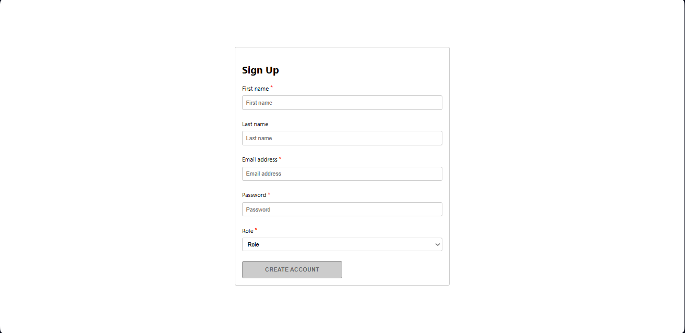

# 🌟 Registration Form - Coursera 🌟

¡Bienvenido/a! Este es un proyecto de formulario de registro desarrollado con **React**. Aquí podrás explorar cómo se valida un formulario, se gestionan estados y se aplican estilos personalizados con CSS.

---

## 📸 Captura de Pantalla



---

## 🚀 Descripción

Este proyecto es un formulario de registro interactivo que incluye:
- Validación de campos obligatorios (nombre, correo, contraseña, rol).
- Mensajes de error dinámicos para contraseñas.
- Diseño responsivo y atractivo.
- Implementación de buenas prácticas en React, como el uso de hooks (`useState`).

Puedes verlo en acción en **GitHub Pages**:  
🔗 [Demo en vivo](https://Avalob.github.io/little-lemon-registration-form)

---

## 🛠️ Tecnologías Utilizadas

- **React**: Biblioteca para construir interfaces de usuario.
- **CSS**: Para el diseño y estilos personalizados.
- **JavaScript**: Para la lógica del formulario.
- **GitHub Pages**: Para el despliegue.

---

## 📦 Instalación

Sigue estos pasos para ejecutar el proyecto en tu máquina local:

1. **Clona el repositorio**:
   ```bash
   git clone https://github.com/Avalob/registration-form-coursera.git
   ```

2. **Accede al directorio del proyecto**:
   ```bash
   cd registration-form-coursera
   ```

3. **Instala las dependencias**:
   ```bash
   npm install
   ```

4. **Ejecuta el proyecto**:
   ```bash
   npm start
   ```

El proyecto se abrirá automáticamente en tu navegador en `http://localhost:3000`.

---

## 🌐 Despliegue en GitHub Pages

El proyecto está desplegado en GitHub Pages. Para actualizar el despliegue:
1. Genera la carpeta `build`:
   ```bash
   npm run build
   ```
2. Sube la carpeta `build` al repositorio remoto.

---


✨ ¡Gracias por visitar este proyecto! Espero que lo disfrutes tanto como yo disfruté creándolo. ✨
